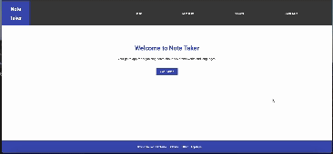
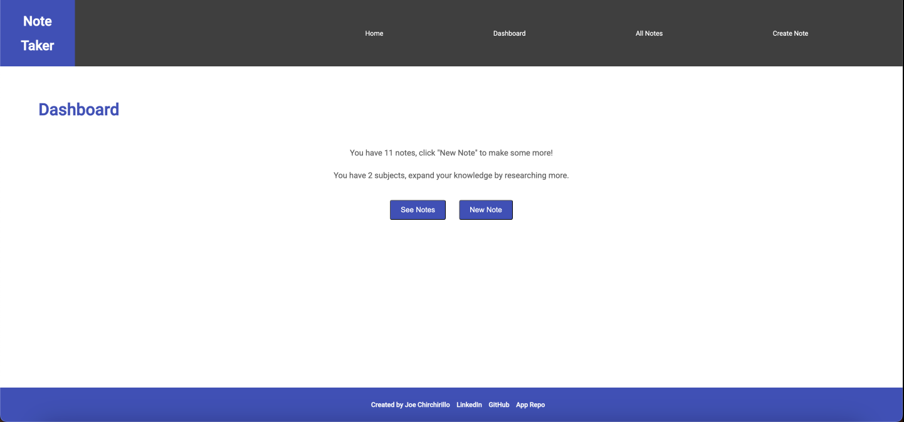
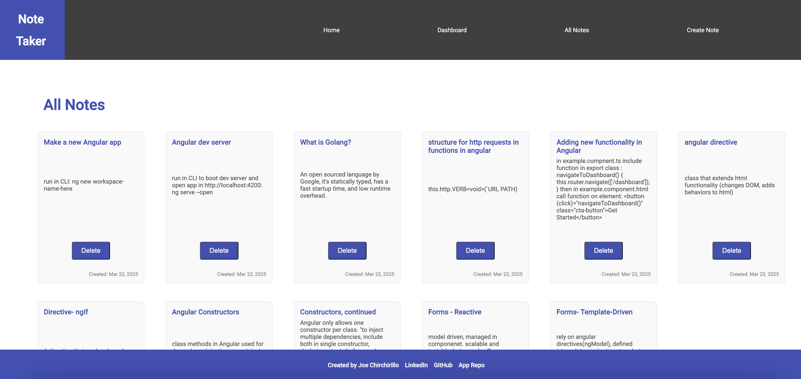
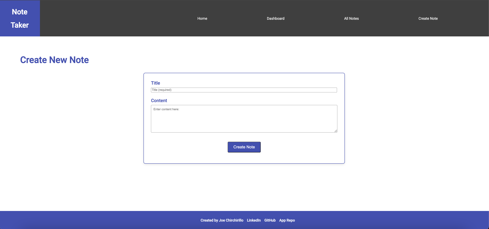

# NoteTaker

NoteTaker is a simple note-taking app built with Angular as a way to document my learning journey with the framework. Each note represents something I learned about Angular while building this app. The goal was to familiarize myself with a new framework, implement CRUD functionality to create a simple MVP, and explore best practices along the way.

## Getting Started

### Backend Setup
This app pairs with a Rails API backend, [note_taker_api](https://github.com/jchirch/note_taker_api). 

**Initialization**

1. Clone into local directory: Run `git clone git@github.com:jchirch/note_taker_api.git`
2. Open in code editor
3. Install dependencies: Run `bundle install` 
4. Open Rails Server: Run `rails s`

### Development server

**Initialization**

1. Clone into local directory: Run `git clone git@github.com:jchirch/noteTaker.git`
2. Open in code editor
3. Install dependencies: Run `npm install` 
4. Start the Angular development server, run `ng serve`, open browser, and navigate to `http://localhost:4200/`.

The application will automatically reload whenever any source files are modified.

## Testing
This app uses Cypress for it's End to End coverage.
1. In Code Editor terminal, run: `npx cypress open`
2. In testing browser click "e2e Testing", select browser of choice, then click "Start E2E Testing in 'browser of choice'".
3. Run spec files.

**Or**

To run e2e without the GUI interface, open Code Editor terminal and run : `npx cypress run`

## Features
- View all notecards
- Create new note
- Delete note
- Dashboard with real-time database updates

## Future Features
- Show single note
- Update/Edit a note
- Unit testing with Karma || Jasmine

## Preview

## Screenshots

## Accessibility
- Scored 100% using Lighthouse accessibility audit!
- Fully tabbable interface
- Descriptive class names and HTML element tags for screen readers
- Good color contrast in styling

## Tech 
- Angular 19.2.1
- Cypress 3.0.0
